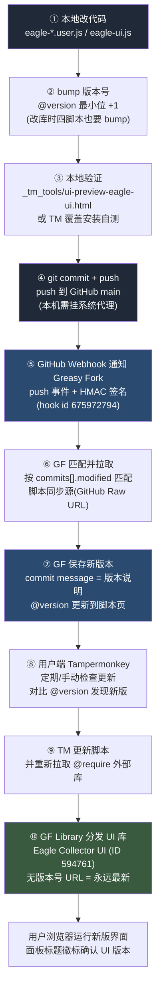

# GitHub 与 Greasy Fork 自动同步操作手册

> 本文档是 Eagle 采集插件家族的发布链路终态手册(2026-09-08 配置完成并验证通过)。
> 同一份内容存于本地知识库:《01. AI/04. AI 编程/03. 制作项目/PC程序/Greasy Fork 与 GitHub 自动同步.md》。

## 整体技术路线与流程图

从改代码到用户浏览器里的插件更新,整条链路共六站:



### 分环节说明

| 环节 | 谁在做 | 关键地址/机制 | 时效 |
|---|---|---|---|
| ①②③ 开发 | 本机 | 版本号必须递增,否则 TM 不识别更新 | 手动 |
| ④ 推送 | git → GitHub | 本机 git 需临时代理:`-c http.proxy=http://127.0.0.1:7897` | 秒级 |
| ⑤ 通知 | GitHub → GF | webhook `api.greasyfork.org/zh-CN/users/1636965-baimoushare/webhook`,push 事件,Secret 签名 | 秒级 |
| ⑥ 匹配 | GF | 只认 `commits[].modified[]` 里的文件,与脚本同步源 raw URL 精确匹配 | 秒级 |
| ⑦ 发版 | GF | 拉取 GitHub Raw 新内容,commit message 作为更新说明 | 秒级 |
| ⑧⑨ 更新 | GF → TM | TM 对比 `@version`(本机 vs GF meta),更新时同步重拉 @require 库 | 定期/手动 |
| ⑩ UI 库 | GF Library | `https://update.greasyfork.org/scripts/594761/Eagle%20Collector%20UI.js` | 跟随脚本更新 |

### 两种日常场景

**场景 A:只改某个脚本**(如修抖音的采集逻辑)

```
改 eagle-douyin-collector.user.js → bump 它的 @version → commit → push
→ webhook 只同步抖音脚本 → 用户 TM 检查更新
```

**场景 B:改共享 UI 库**(如调面板配色/选择器交互)

```
改 eagle-ui.js → bump 库内 VERSION → 四个脚本 @version 各 +最小位
→ commit(四脚本在 modified 列表里,webhook 同步四个脚本)
→ 用户更新脚本时,TM 重新拉取 Library 拿到新 UI
```

> 注意:只改 eagle-ui.js 而不动四个脚本时,GF 只会更新 Library,用户端不会感知(脚本版本没变,TM 不触发更新)。所以改库必须连带 bump 四脚本。

### 链路卡点速查

| 症状 | 断点位置 | 排查动作 |
|---|---|---|
| GF 脚本页版本没变 | ⑤⑥ webhook 或匹配 | GitHub 仓库 → Settings → Webhooks → Recent Deliveries,看 push 是否 200;确认改动文件在 commit 的 modified 里 |
| deliveries 里没有 push 记录 | ④ 没推上去 | 本机 git 是否走了代理(`-c http.proxy=...`) |
| delivery 非 200 | ⑤ 签名/URL | Secret 与 GF webhook-info 页面一致;Payload URL 原样复制 |
| GF 更新了但 TM 没提示 | ②⑧ 版本号 | 本次发布是否递增了 @version;TM 手动"检查更新" |
| 脚本能更新但界面没变化 | ⑩ 库没更新 | Library 页面版本是否最新;脚本 @require 是否用无版本号地址 |
| push 了但 GF 毫无反应(且无 webhook 报错) | ⑥ 只新增了文件 | GF 只匹配 modified,纯新增文件不触发;先在 GF 建好同步源再改文件 |

## 当前配置状态(2026-09-08)

- **Greasy Fork Library**:「Eagle Collector UI」,ID `594761`,页面 https://greasyfork.org/zh-CN/scripts/594761
  - 同步源:`https://raw.githubusercontent.com/baimoushare/eagle-plugin/main/eagle-ui.js`
  - 引用地址(**无版本号=永远最新**,勿用带 `/1924684/` 版本段的链接):
    `https://update.greasyfork.org/scripts/594761/Eagle%20Collector%20UI.js`
- **四个脚本同步源**(GF 脚本管理页"源码同步"处填写):
  - `https://raw.githubusercontent.com/baimoushare/eagle-plugin/main/eagle-fab-collector.user.js`
  - `https://raw.githubusercontent.com/baimoushare/eagle-plugin/main/eagle-web-collector.user.js`
  - `https://raw.githubusercontent.com/baimoushare/eagle-plugin/main/eagle-x-collector.user.js`
  - `https://raw.githubusercontent.com/baimoushare/eagle-plugin/main/eagle-douyin-collector.user.js`
- **GitHub Webhook**:hook id `675972794`,Payload URL = GF 专属地址,`application/json`,仅 push 事件,Secret 已配置,ping/push 投递均验证 200

## 历史报错与原因(已解决)

Greasy Fork 曾拒绝脚本直接引用自有 jsDelivr 文件:

> 脚本同步失败 - Code 使用了一个未被允许的外部脚本:`@require https://cdn.jsdelivr.net/gh/baimoushare/eagle-plugin@main/eagle-ui.js`

根因:GF 外部代码政策不接受不受认可来源的自有直链。解决:库改以 GF Library 分发,脚本 @require 引用 GF 托管地址;jsDelivr 方案整体停用。

## 私有仓库限制

GitHub 私有仓库无法用于本链路:GF 同步源与 webhook 都要求匿名可读的公开 URL;webhook Secret 只是签名密钥,不能代替 GitHub 访问令牌。仓库须保持 Public。

## 官方来源

- <https://greasyfork.org/zh-CN/users/webhook-info>
- <https://greasyfork.org/zh-CN/help/external-scripts>
- <https://github.com/greasyfork-org/greasyfork/blob/main/app/views/users/webhook_info.html.erb>
- <https://github.com/greasyfork-org/greasyfork/blob/main/app/controllers/concerns/webhooks.rb>
- <https://github.com/greasyfork-org/greasyfork/blob/main/lib/github.rb>
